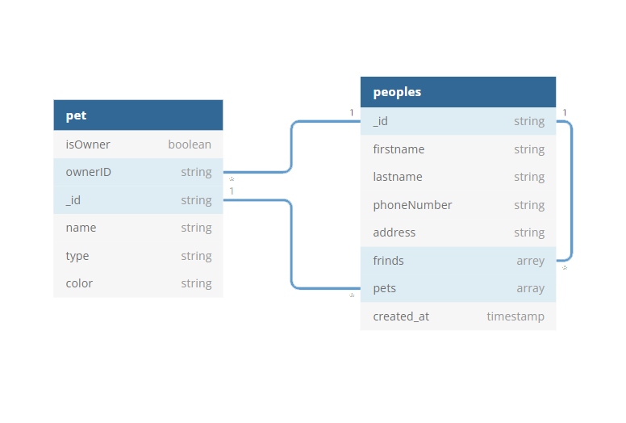

<p align="center"></p>

# PeoplePets (the backend)

PeoplePets is an backend development evaluation task. In this program, you can see how to create, read, edit and delete through the web service with Mango database.

Goals
1. To produce a fully working proof of concept API server and accompanying NoSQL
database layer
2. Use an existing open-source modules to quickly build new products
3. Show your ability to create maintainable and extendable code
4. Explain your coding decisions and architecture choices at time of code review

# Table of Contents

- [1. Installation](#1-installation)
  - [1.1 Production](#1-1-production)
  - [1.2 Development](#1-2-development)
- [2. Project architecture](#2-project-architecture)
- [3. API documentation](#3-api-documentation)
- [4. Contribution](#4-contribution)

# 1. Installation

To install and use this project, you have two options, first is installing for deployment. We use docker to deploy the product on the host machine. The second option is installing for development. In development, the installation process will set up all required packages for running the project. Once the installation completes, you will be able to run the project on your local machine at port number **3000**(aka. leet).

## 1.1 Production

To build the project for production, you need the following requirements:

1. NodeJs Version 16.13.0 (LTS) or above.
2. Git version controller.
3. Yarn package manager.

To get started, first, please clone the project:

```console
$ git clone https://github.com/sbahramian/peoplepets.git
```

For compilation type:

```console
$ yarn build
```

It compiles the project and places the compiled files inside the `./dist` directory.
You can deploy the compiled version using Docker, Node, Nginx, or whatever you like.
To do so, you have to go inside the `./dist` directory and type `yarn install` to install the required packages. Using the `.env` file generated inside `./dist`, you can change the project's configurations.
You can run the compiled version using:

```console
$ cd ./dist
$ node ./src/app.js
```

There is another option to deploy the project and which is using pre-build Docker images which they will be present in our release page. You can simply download the images and deploy them on a host which has a properly installed docker container.

Also, its possible to deploy on a docker via cloning the image from our internal docker compose server which acts like the original docker hub. **It would be guaranteed that there always be a docker image of all stable versions of the project in out docker hub and in addition we include the latest Beta version of the project which is the image of latest develop branch**.

To build docker files, type:
```console
$ yarn build
$ yarn build:docker
```
This will generate a docker image in `.tar` formant and places inside `./bin` directory. To clean the compiled files type:

```console
$ yarn clean
```


## 1.2 Development

To install and setup the project for development, you need to have installed these requirements first:

1. Nodejs version 16.13.0 (LTS) or above.
2. Yarn package manager
3. Git version control
4. Mongodb database (LTS)

To install nodejs and npm you can simply type:

```shell
$ sudo apt install nodejs npm
```

After installing _node_ and _npm_ you can install **yarn** using npm:

```shell
$ npm install --global yarn
```

Well done, you have all requirements installed on your computer. Let's clone the project:

```shell
$ git clone --recurse-submodule https://github.com/sbahramian/peoplepets.git
```

To download node modules, type:

```shell
$ cd peoplepets-backend
$ yarn install
```

Congrats, the required packages are installed now, and a few steps are left to get the job done. If you did the steps currently, you could see a **.env.example** file inside the root directory of the project. Make a copy of _.env.example_ file and rename it to **.env**. We place the project environment variables such as port number, hostname, etc., inside this file.

You are almost done, but there is one step to go with, **installing the database**. PeoplePets uses MongoDB as the primary database. To install MongoDB locally, you need to follow the steps suggested in MongoDB [official website](https://docs.mongodb.com/manual/installation/). The default URL of the database is set to `mongodb://localhost:27017/peoplepets`, but you can change this URL if you already have a configured database somewhere else and don't want to install the database on your local machine. For example, if you have a VM and there you have a MongoDB installed, to access that database, you can replace the **Db_Url** inside the **.env** file inside the root directory of the project.

> You can change the database URL inside `.env` but, remember that you need to restart the project each time you edit the environment file.

That's it; you successfully installed the project.
To run the project, please enter the following command in your terminal:

```console
$ yarn serve
```

# 2. Project architecture

<p align="center"></p>

# 3. API documentation

You can use the **postman.json** file. Import it in Postman. Download link [https://github.com/sbahramian/peoplepets/blob/main/postman.json]

# 4. Contribution

For contribution please read our [contribution guide](docs/contribution) section carefully.
